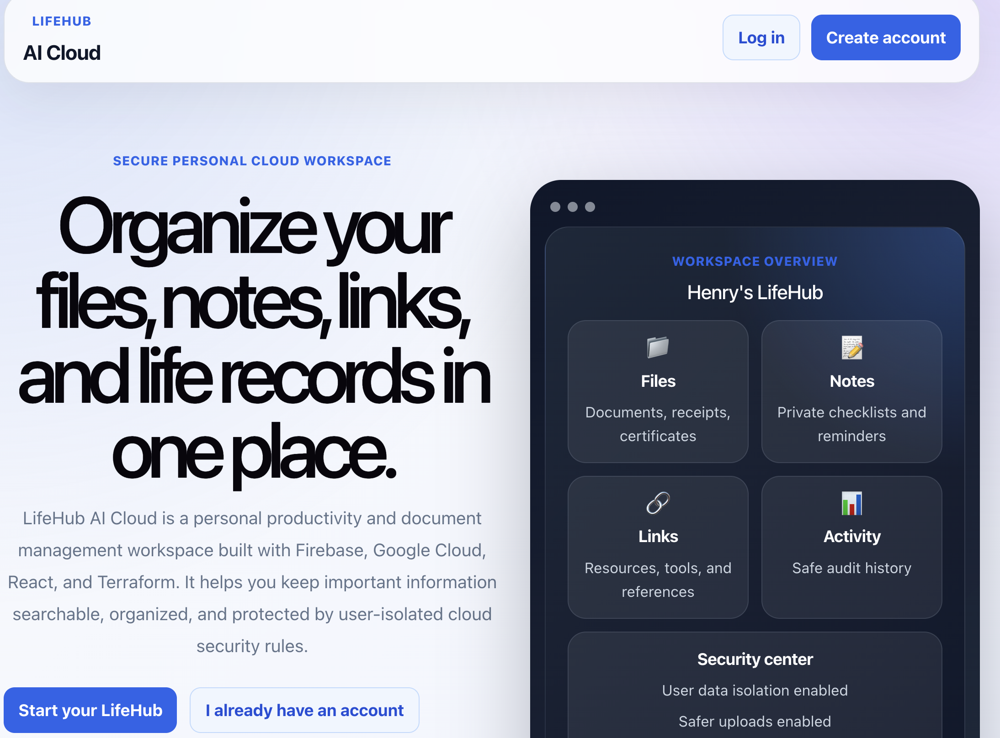
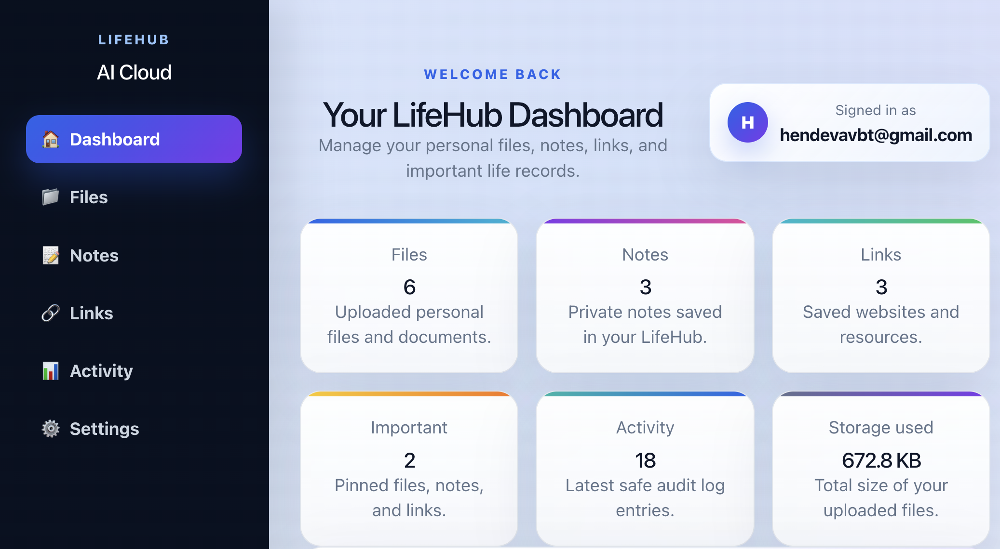
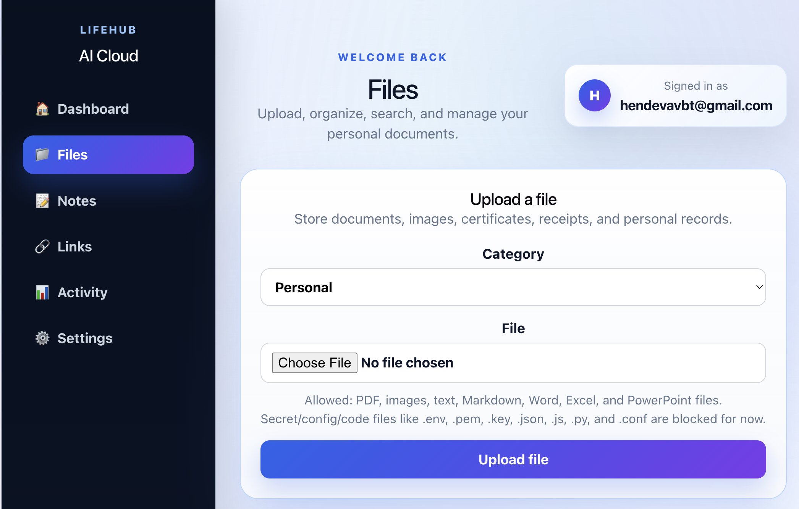
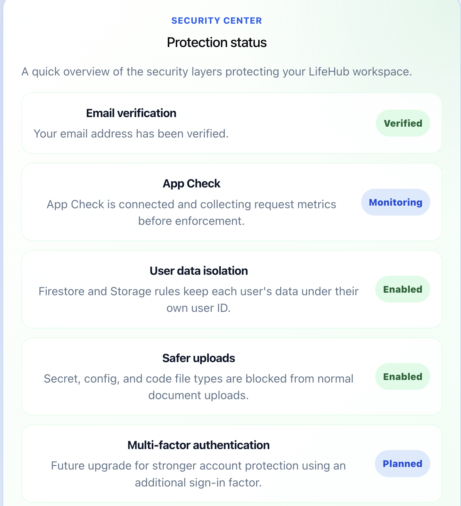

# LifeHub AI Cloud


LifeHub AI Cloud is a secure personal productivity and document management web app built with **React**, **Firebase**, **Google Cloud**, and **Terraform**.

It helps users organize personal files, private notes, useful links, important items, profile settings, and safe activity history in one cloud-based workspace.

**Live app:** https://lifehub-ai-cloud.web.app

---

## Screenshots

> Screenshots are stored using relative image paths so they render correctly inside GitHub.

### Landing Page



### Dashboard



### File Library



### Security Center



---

## Overview

LifeHub AI Cloud is designed as a portfolio-ready cloud application that demonstrates full-stack product thinking, Firebase development, serverless architecture, cloud security rules, infrastructure-as-code, CI/CD, and deployment workflow.

The app includes:

- Public landing page
- Email/password authentication
- Password reset
- Account deletion flow
- Dashboard
- File library
- Notes
- Saved links
- Important item tracking
- Activity log
- Profile settings
- Security center
- Firebase Cloud Functions backend
- Gemini AI summary prototype
- Firebase Hosting GitHub Actions deployment
- Build-only GitHub Actions CI workflow
- Terraform infrastructure folder

AI note summary support is implemented through Firebase Cloud Functions and Gemini API integration, but Gemini API billing is currently disabled/skipped for cost control.

---

## Key Features

### Public Landing Page

- SaaS-style public home page
- Product overview and feature explanation
- Sign in and create account entry points
- Cloud/security stack preview
- Portfolio-ready first impression

### Authentication

- Email/password registration
- Email/password login
- Password reset email flow
- Strong password validation
- Confirm password validation
- Show/hide password controls
- Friendly authentication error messages
- Email verification support
- Account deletion flow with typed confirmation

Firebase Authentication supports email/password accounts and password reset emails for web apps.

### Dashboard

- Workspace overview
- File, note, link, activity, important item, and storage stats
- Quick actions
- Recent files
- Recent notes
- Recent links
- Important items overview
- Recent safe activity feed

### File Library

- Upload personal files
- Store files in Firebase Storage
- Save file metadata in Cloud Firestore
- Search files by name
- Filter files by category
- Sort files by newest, oldest, name, or size
- Mark files as important
- Delete files safely
- Block risky file types such as `.env`, `.pem`, `.key`, `.json`, `.js`, and `.py`

### Notes

- Create private notes
- Edit notes
- Delete notes
- Search notes by title or content
- Sort notes
- Mark notes as important
- AI summary button connected to backend Cloud Function

### Links

- Save useful URLs
- Organize links by category
- Search links
- Sort links
- Mark links as important
- Edit saved links
- Delete saved links

### Activity Log

- Safe audit history
- Tracks generic user actions only
- Search activity
- Filter by activity type
- Portfolio-ready audit logging story

### Settings

- User profile settings
- Workspace name settings
- Usage overview
- Email verification status
- Security center
- Logout
- Account deletion
- Future encrypted Vault placeholder

---

## Tech Stack

### Frontend

- React
- Vite
- JavaScript
- CSS

### Backend / Cloud

- Firebase Authentication
- Cloud Firestore
- Firebase Storage
- Firebase Hosting
- Firebase Cloud Functions
- Firebase App Check
- Google Cloud Platform

Firebase Hosting provides production-grade hosting for web apps and is optimized for static and single-page apps. It can deploy web apps to a global CDN with the Firebase CLI.

### Infrastructure / DevOps

- Terraform
- Google Cloud Provider
- Firebase CLI
- Google Cloud CLI
- Git / GitHub
- GitHub Actions

---

## Architecture

```text
User Browser
    |
    v
React + Vite Frontend
    |
    v
Firebase Hosting
    |
    +--> Firebase Authentication
    |
    +--> Cloud Firestore
    |       - user profile
    |       - file metadata
    |       - notes
    |       - links
    |       - activity logs
    |
    +--> Firebase Storage
    |       - uploaded user files
    |
    +--> Firebase Cloud Functions
            - AI note summary callable function
            - Gemini API integration
            - Secret Manager integration